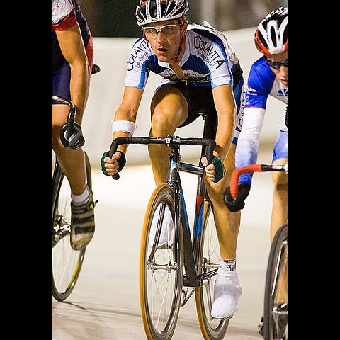
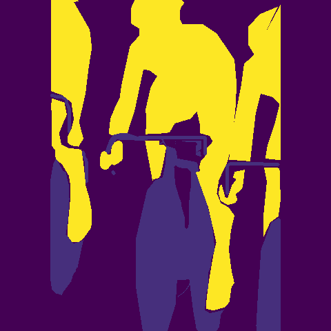
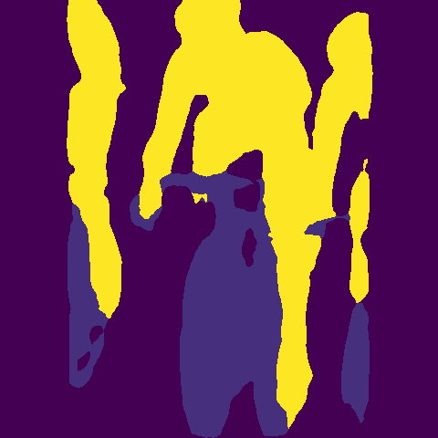
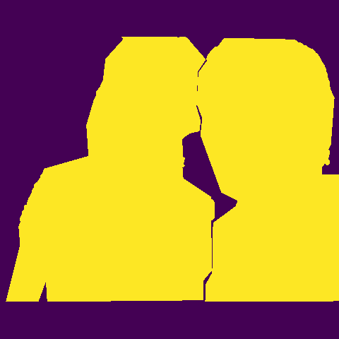
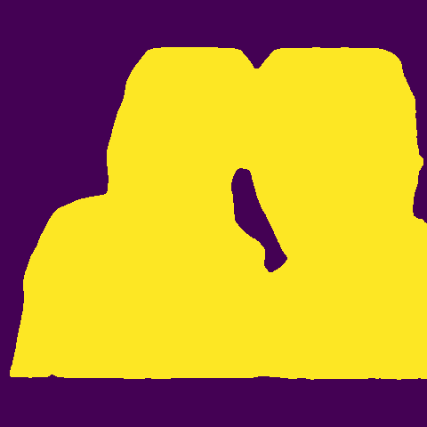
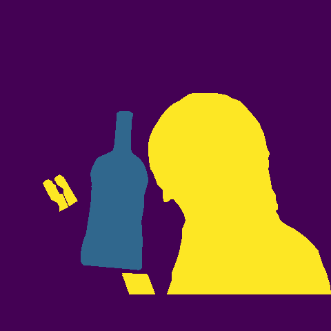
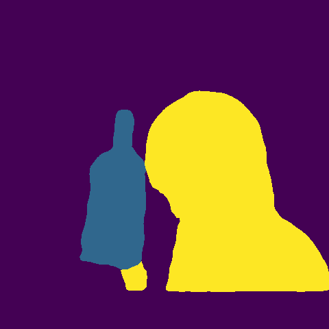

# BLSeg (BaseLine Segmentation)

PyTorch's Semantic Segmentation Toolbox

- [BLSeg (BaseLine Segmentation)](#blseg-baseline-segmentation)
  - [Requirement](#requirement)
  - [Supported Module](#supported-module)
  - [Parameters](#parameters)
  - [Visualization](#visualization)
  - [Docs](#docs)
  - [Changelog](#changelog)
  - [References](#references)

## Requirement

- Python 3
- PyTorch >= 1.0.0

## Supported Module

- Backbone
  - [VGG16]
  - [MobileNet v1] (1.0)
  - [MobileNet v2] (1.0)
  - [ResNet 34]
  - [ResNet 50] (Modified according to [Bag of Tricks])
  - [SE ResNet 34]
  - [SE ResNet 50] (Modified according to [Bag of Tricks])
  - [Modified Aligned Xception]
- Model
  - [FCN]
  - [U-Net]
  - [PSPNet]
  - [DeepLab v3+]
  - [GCN]
- Loss
  - BCEWithLogitsLossWithOHEM
  - CrossEntropyLossWithOHEM
  - DiceLoss (only for binary classification)
  - SoftCrossEntropyLossWithOHEM
- Metric
  - Pixel Accuracy
  - Mean IoU

Each model can choose any backbone without any modification

|       Backbone \ Model        | **FCN** | **U-Net** | **PSPNet** | **DeepLab v3+** | **GCN** |
| :---------------------------: | :-----: | :-------: | :--------: | :-------------: | :-----: |
|           **VGG16**           | &radic; |  &radic;  |  &radic;   |     &radic;     | &radic; |
|       **MobileNet v1**        | &radic; |  &radic;  |  &radic;   |     &radic;     | &radic; |
|       **MobileNet v2**        | &radic; |  &radic;  |  &radic;   |     &radic;     | &radic; |
|         **ResNet34**          | &radic; |  &radic;  |  &radic;   |     &radic;     | &radic; |
|         **ResNet50**          | &radic; |  &radic;  |  &radic;   |     &radic;     | &radic; |
|        **SE ResNet34**        | &radic; |  &radic;  |  &radic;   |     &radic;     | &radic; |
|        **SE ResNet50**        | &radic; |  &radic;  |  &radic;   |     &radic;     | &radic; |
| **Modified Aligned Xception** | &radic; |  &radic;  |  &radic;   |     &radic;     | &radic; |

Model pre-trained on augmented PASCAL VOC2012 dataset with 10582 images for training and 1449 images for validation.

You can download pre-trained parameters at [Google Drive]

## Parameters

|       Backbone \ Model        | **FCN** | **U-Net** | **PSPNet** | **DeepLab v3+** | **GCN** |
| :---------------------------: | ------: | --------: | ---------: | --------------: | ------: |
|           **VGG16**           | 134.41M |    25.26M |     19.70M |          20.15M |  14.99M |
|       **MobileNet v1**        | 225.66M |    14.01M |     13.70M |          12.44M |   3.58M |
|       **MobileNet v2**        | 276.06M |     2.67M |     15.67M |          13.35M |   2.51M |
|         **ResNet34**          | 140.98M |    24.08M |     26.27M |          26.71M |  21.48M |
|         **ResNet50**          | 451.51M |    66.35M |     46.61M |          40.37M |  24.24M |
|        **SE ResNet34**        | 141.14M |    24.25M |     26.43M |          26.87M |  21.64M |
|        **SE ResNet50**        | 454.02M |    69.03M |     49.12M |          42.88M |  26.76M |
| **Modified Aligned Xception** | 465.85M |    57.46M |     60.95M |          54.70M |  38.46M |

## Visualization

|       Original Image        |       Ground Truth        |                Ours                 |
| :-------------------------: | :-----------------------: | :---------------------------------: |
|  |  |  |
|  |  |  |
|  |  |  |

## Docs

See [Docs]

## Changelog

See [Changelog]

## References

- Simonyan, Karen, and Andrew Zisserman. "Very deep convolutional networks for large-scale image recognition." arXiv preprint arXiv:1409.1556 (2014).
- Howard, Andrew G., et al. "Mobilenets: Efficient convolutional neural networks for mobile vision applications." arXiv preprint arXiv:1704.04861 (2017).
- Sandler, Mark, et al. "Mobilenetv2: Inverted residuals and linear bottlenecks." Proceedings of the IEEE Conference on Computer Vision and Pattern Recognition. 2018.
- He, Kaiming, et al. "Deep residual learning for image recognition." Proceedings of the IEEE conference on computer vision and pattern recognition. 2016.
- Xie, Junyuan, et al. "Bag of tricks for image classification with convolutional neural networks." arXiv preprint arXiv:1812.01187 (2018).
- Hu, Jie, Li Shen, and Gang Sun. "Squeeze-and-excitation networks." Proceedings of the IEEE conference on computer vision and pattern recognition. 2018.
- Long, Jonathan, Evan Shelhamer, and Trevor Darrell. "Fully convolutional networks for semantic segmentation." Proceedings of the IEEE conference on computer vision and pattern recognition. 2015.
- Ronneberger, Olaf, Philipp Fischer, and Thomas Brox. "U-net: Convolutional networks for biomedical image segmentation." International Conference on Medical image computing and computer-assisted intervention. Springer, Cham, 2015.
- Zhao, Hengshuang, et al. "Pyramid scene parsing network." Proceedings of the IEEE conference on computer vision and pattern recognition. 2017.
- Chen, Liang-Chieh, et al. "Encoder-decoder with atrous separable convolution for semantic image segmentation." Proceedings of the European Conference on Computer Vision (ECCV). 2018.
- Peng, Chao, et al. "Large Kernel Matters--Improve Semantic Segmentation by Global Convolutional Network." Proceedings of the IEEE conference on computer vision and pattern recognition. 2017.

---

[VGG16]:https://arxiv.org/abs/1409.1556
[MobileNet v1]:https://arxiv.org/abs/1704.04861
[MobileNet v2]:https://arxiv.org/abs/1801.04381
[ResNet 34]:https://arxiv.org/abs/1512.03385
[ResNet 50]:https://arxiv.org/abs/1512.03385
[SE ResNet 34]:https://arxiv.org/abs/1709.01507
[SE ResNet 50]:https://arxiv.org/abs/1709.01507
[Modified Aligned Xception]:https://arxiv.org/abs/1802.02611
[Bag of Tricks]:https://arxiv.org/abs/1812.01187

[FCN]:https://arxiv.org/abs/1411.4038
[U-Net]:https://arxiv.org/abs/1505.04597
[PSPNet]:https://arxiv.org/abs/1612.01105
[DeepLab v3+]:https://arxiv.org/abs/1802.02611
[GCN]:https://arxiv.org/abs/1703.02719

[Google Drive]:https://drive.google.com/drive/folders/1i1vhf-JQ_K-5SzS7OJQ9ns3wHCEwoSuD?usp=sharing
[Docs]:Docs.md
[Changelog]:Changelog.md
